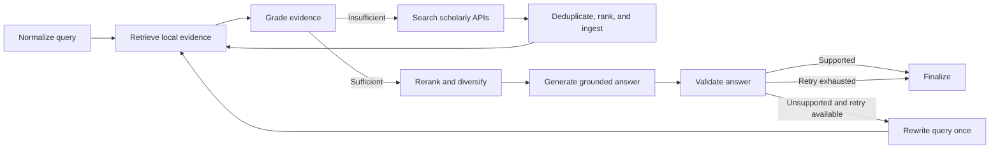

# ScholarX - LangGraph Research Paper RAG

A research-paper discovery and grounded question-answering application built with
LangGraph, LangChain, ChromaDB, Sentence Transformers, Streamlit, and FastAPI.
ScholarX searches multiple scholarly sources, ingests open-access papers, retrieves
relevant evidence, validates answers, and exposes citations and workflow diagnostics.

## 🧭 LangGraph Workflow

Enhanced RAG requests run through a bounded, deterministic graph. The graph does not
use an unrestricted tool-selecting agent.



Default safety bounds:

- At most one external-search cycle.
- At most one answer-validation retry.
- SQLite checkpoints keyed by conversation thread.
- Deterministic evidence grading and extractive generation remain available when
  an LLM provider is unavailable.
- The previous non-LangGraph pipeline remains available with
  `USE_LANGGRAPH=false`.

## 🚀 Quick Start

### Option 1: Streamlit Web App (Recommended)
```bash
# Install dependencies
pip install -r requirements.txt

# Create local configuration
cp .env.example .env

# Run Streamlit app
streamlit run streamlit_app.py
# Or use the script:
./run_app.sh

# App opens at http://localhost:8501
```

### Option 2: Command Line
```bash
# Install dependencies
pip install -r requirements.txt

# Query interactively
python3 query_interactive.py

# Or use Python API
python3
>>> from main import query_rag
>>> result = query_rag("What is transformer architecture?")
```

### Option 3: HTTP API Server (FastAPI)
```bash
# Install dependencies
pip install -r requirements.txt

# Run API server
./run_api.sh
# Or directly:
uvicorn api.server:app --host 0.0.0.0 --port 8000

# OpenAPI docs
# http://localhost:8000/docs
```

## 📁 Project Structure

```
python-rag/
├── main.py                    # Core functions
├── add_papers.py              # Add papers (interactive)
├── query_interactive.py        # Query interface (with modes)
├── manage_papers.py            # Collection management
├── view_results.py            # View saved queries
├── streamlit_app.py           # Main Streamlit application
├── run_app.sh                 # Quick start script
├── api/                       # Feature APIs
│   ├── main_api.py           # Unified API interface
│   ├── paper_api.py          # Paper details & summaries
│   ├── citations.py          # Citation graph
│   ├── summaries.py          # Auto-summarization
│   ├── authors.py            # Author graph & stats
│   ├── topics.py             # Topic clustering
│   ├── rag_modes.py          # Advanced RAG modes
│   ├── deduplication.py       # Duplicate detection
│   ├── similarity.py         # Similarity checking
│   ├── ranking.py            # Citation rankings
│   ├── query_logger.py       # Query analytics
│   ├── recommendations.py    # Paper recommendations
│   ├── trends.py             # Research trend analysis
│   ├── research_gaps.py      # Research gap identification
│   ├── query_intent.py       # Query intent classification
│   ├── exports.py            # Export capabilities
│   ├── relevance_ranking.py  # Relevance ranking
│   └── search.py             # Search interface
├── config/                    # Configuration
│   ├── settings.py
│   ├── chroma_client.py
│   └── openai_client.py
├── ingestion/                 # Paper loading
│   ├── pdf_loader.py
│   ├── paper_fetcher.py
│   ├── ingest_pipeline.py
│   ├── enhanced_metadata.py
│   ├── arxiv_enhanced.py
│   ├── semantic_scholar_enhanced.py
│   ├── crossref_api.py
│   ├── openalex_api.py
│   └── text_cleaner.py
├── processing/                # Text processing
│   ├── chunker.py
│   ├── advanced_chunker.py
│   └── embeddings.py
├── vectorstore/               # Vector operations
│   ├── upsert.py
│   └── query.py
├── rag/                       # RAG pipeline
│   ├── pipeline.py
│   ├── langgraph_pipeline.py # Stateful bounded research workflow
│   ├── langchain_models.py   # Model factory, graders, validation
│   ├── langchain_adapters.py # Existing retrieval as LangChain retriever
│   ├── retriever.py
│   ├── generator.py
│   ├── hybrid_search.py
│   ├── reranker.py
│   ├── quality_scorer.py
│   ├── query_expander.py
│   └── search_enhanced.py
├── evaluation/                # Evaluation framework
│   ├── metrics.py            # Evaluation metrics
│   ├── baselines.py          # Baseline systems
│   ├── datasets.py           # Dataset loading
│   ├── statistical_analysis.py # Statistical tests
│   ├── run_evaluation.py     # Evaluation runner
│   └── ablation_study.py     # Ablation study
└── utils/                     # Utilities
    ├── logger.py
    ├── timers.py
    └── cache.py
```

## ✨ Features

### Core Features
- ✅ **PDF Ingestion**: Load papers from URLs or Semantic Scholar/ArXiv
- ✅ **Semantic Search**: Vector-based similarity search
- ✅ **Metadata Storage**: Title, authors, abstract, year, DOI, etc.
- ✅ **RAG QA**: Question answering with citations
- ✅ **LangGraph Orchestration**: Explicit retrieval, grading, generation, and validation nodes
- ✅ **Conversation Persistence**: SQLite graph checkpoints per Streamlit chat thread
- ✅ **Progress Streaming**: Live node-level workflow status in Streamlit
- ✅ **Controlled Recovery**: Conditional external search and one bounded answer retry
- ✅ **Evidence Validation**: Structured LLM grading with deterministic fallback

### Advanced Features
- ✅ **Hybrid Search**: Combines semantic + keyword search
- ✅ **Multi-Source Discovery**: ArXiv, Semantic Scholar, Crossref, OpenAlex, and CORE
- ✅ **Literature Review Search**: Query expansion, deduplication, quality labels, and review-ready export
- ✅ **Paper API**: Get paper details, summaries, chunks
- ✅ **Citation Graph**: Find related and citing papers
- ✅ **Auto Summaries**: Generate short, medium, and bullet-point summaries
- ✅ **Author Graph**: Author statistics, co-author networks, profiles
- ✅ **Topic Clustering**: Organize papers by topics using K-Means
- ✅ **Advanced RAG Modes**: Concise, detailed, explain, compare, literature survey
- ✅ **Multi-Document Synthesis**: Query across multiple specific papers
- ✅ **Citation Ranking**: Rank papers by citation metrics
- ✅ **Related Papers**: Find similar papers automatically
- ✅ **Deduplication**: Detect and merge duplicate papers
- ✅ **Similarity Checking**: Compare papers or check text similarity

### Enhanced API Features
- ✅ **Full ArXiv API**: Field searches, Boolean operators, date filters
- ✅ **Full Semantic Scholar API**: Autocomplete, batch lookup, enhanced search
- ✅ **Crossref API**: Metadata retrieval, DOI resolution
- ✅ **OpenAlex API**: Comprehensive paper metadata
- ✅ **Author Search**: With h-index, citations, affiliations
- ✅ **Advanced Filters**: Year ranges, categories, citation counts, open access

### Unique Features
- ✅ **Paper Recommendations**: Based on queries and reading history
- ✅ **Research Trend Analysis**: Topic popularity over time, future predictions
- ✅ **Research Gap Identification**: Find underexplored areas
- ✅ **Query Intent Classification**: Automatic intent detection and routing
- ✅ **Export Capabilities**: BibTeX, CSV, JSON, Markdown formats
- ✅ **Performance Caching**: Intelligent caching layer
- ✅ **Relevance Ranking**: Multi-factor ranking with visual indicators

## 📖 Usage

### Add Papers
```bash
python3 add_papers.py
# Option 1: Fetch by topic
# Option 2: Add from PDF URL
```

### Query System
```bash
python3 query_interactive.py
# Ask questions naturally
# Results saved automatically
```

### Manage Collection
```bash
python3 manage_papers.py
# List, delete, export, view stats
```

### Use API Programmatically
```python
from api.main_api import api

# Get paper details
paper = api.get_paper("paper-id")

# Generate summary
summary = api.generate_summary("paper-id")

# Advanced RAG modes
result = api.rag_concise("What is attention?")
result = api.rag_compare("Compare transformer architectures")
result = api.rag_survey("neural machine translation")

# Author analysis
stats = api.get_author_statistics()
profile = api.get_author("John Doe")

# Topic clustering
clusters = api.cluster_topics(num_clusters=5)

# Recommendations
recommendations = api.recommend_papers(limit=10)
recommendations_for_query = api.recommend_for_query("transformer architecture", limit=5)

# Trend Analysis
trends = api.analyze_trends(years=[2020, 2021, 2022, 2023, 2024])
field_trend = api.get_field_trends("transformer")
future = api.predict_trends("transformer", years_ahead=3)

# Research Gaps
gaps = api.find_gaps("neural machine translation", min_papers=5)
combination_gap = api.find_combination_gaps("transformer", "computer vision")
directions = api.suggest_directions("attention mechanisms")

# Query Intent
intent = api.classify_intent("Compare transformer and RNN architectures")
routing = api.route_query("What are the latest trends in NLP?")

# Exports
api.export_bibtex(filename="my_papers.bib")
api.export_csv(filename="papers.csv")
api.export_markdown(filename="library.md")
```

## ⚙️ Configuration

Edit `.env`:
```env
EMBEDDING_PROVIDER=sentence-transformers

# grok | openai | ollama | simple
LLM_PROVIDER=simple
GROK_API_KEY=
OPENAI_API_KEY=
OLLAMA_BASE_URL=http://localhost:11434

CHUNK_SIZE=1000
CHUNK_OVERLAP=200
DEFAULT_TOP_K=5
MAX_PAPERS_PER_QUERY=5

USE_LANGGRAPH=true
LANGGRAPH_CHECKPOINT_PATH=./.runtime/langgraph_checkpoints.sqlite3
LANGGRAPH_MAX_EXTERNAL_SEARCHES=1
LANGGRAPH_MAX_ANSWER_RETRIES=1
LANGGRAPH_MIN_CONTEXT_CHUNKS=3
LANGGRAPH_MIN_RELEVANCE_SCORE=0.45
LANGGRAPH_INGEST_LIMIT=3
LANGGRAPH_USE_LLM_GRADER=true

SEMANTIC_SCHOLAR_API_KEY=
CORE_API_KEY=
CROSSREF_MAILTO=
```

Use `simple` for a key-free extractive fallback. For synthesized answers and LLM
evidence grading, configure a funded Grok/OpenAI account or a reachable Ollama
instance. API keys belong in `.env` or deployment secrets, never in source control.

## 🔧 Requirements

- Python 3.10+
- See `requirements.txt` for dependencies
- No API keys needed for free mode!

## 🧪 Validation

Run the focused LangGraph and citation regression tests:

```bash
python3 -m pytest -q \
  test_langgraph_pipeline.py \
  test_citation_graph_identifiers.py
```

Run the complete project validation:

```bash
python3 test_all_modules.py
```

Run the optional live multi-source search smoke check:

```bash
python3 streamlit_search_smoke.py
```

The current validation baseline is 81 passed, 0 failed, and 2 intentionally
skipped slow embedding tests. The focused LangGraph/citation suite contains 9
passing tests.

## 🚢 Deployment

### Streamlit Community Cloud

1. Push this repository to GitHub.
2. Create a Streamlit app with `streamlit_app.py` as the entry point.
3. Add provider keys and configuration through Streamlit Secrets.
4. Keep `CHROMA_PERSIST_DIR` and `LANGGRAPH_CHECKPOINT_PATH` writable.

SQLite checkpoints are suitable for one application instance. Streamlit
Community Cloud filesystems can be ephemeral, so long-term conversation history
requires persistent storage. Multi-instance deployments should replace SQLite
with a shared production checkpointer such as PostgreSQL.

### FastAPI

```bash
uvicorn api.server:app --host 0.0.0.0 --port 8000
```

Health check:

```bash
curl http://localhost:8000/health
```

## 📡 APIs Used

### ArXiv API (Free, No Key)
- **Base URL**: `http://export.arxiv.org/api/query`
- **Features**: Field searches, Boolean operators, date filtering, sorting
- **Rate Limits**: None (be respectful, 3s delay recommended)

### Semantic Scholar API (Free, Optional Key)
- **Base URL**: `https://api.semanticscholar.org/graph/v1`
- **Features**: Autocomplete, batch lookup, enhanced search, citations/references
- **Rate Limits**: 100 requests per 5 minutes (free), higher with API key

### Crossref API (Free, No Key)
- **Base URL**: `https://api.crossref.org`
- **Features**: Metadata retrieval, DOI resolution

### OpenAlex API (Free, No Key)
- **Base URL**: `https://api.openalex.org`
- **Features**: Comprehensive paper metadata

### CORE API (Key Required)
- **Base URL**: `https://api.core.ac.uk/v3`
- **Features**: Open-access paper discovery, metadata, and downloadable full-text links

## ⚠️ When ScholarX Fails

ScholarX is designed for robust performance, but like any RAG system, it has known failure modes. Understanding these limitations strengthens the system's reliability claims.

### Sparse Literature

**Problem**: When querying topics with very few published papers (< 5 papers), retrieval quality degrades significantly.

**Why it happens**: 
- Vector search requires sufficient semantic diversity to find relevant chunks
- Hybrid search relies on keyword overlap, which is minimal in sparse domains
- Reranking has limited candidates to choose from

**Mitigation strategies**:
- System automatically fetches papers on-demand when collection is sparse
- Falls back to broader query expansion (e.g., "quantum computing" → "quantum", "computing", "quantum algorithms")
- Warns users when retrieved context is below quality thresholds

**Example**: Querying "quantum error correction in biological systems" may return only 1-2 papers, leading to incomplete answers.

### Conflicting Citations

**Problem**: When papers in the collection present contradictory information, the system may synthesize conflicting claims without clear attribution.

**Why it happens**:
- RAG generation combines multiple sources without explicit conflict resolution
- Quality scoring doesn't account for citation conflicts
- No built-in fact-checking or consensus mechanism

**Mitigation strategies**:
- Use "compare" mode to explicitly surface different perspectives
- Check citation breakdowns to identify conflicting sources
- Leverage citation graph to find papers that address contradictions

**Example**: Papers A and B both claim "X improves Y by 50%" but with different methodologies. ScholarX may present both without highlighting the contradiction.

### Very New Topics

**Problem**: Topics published in the last 6-12 months may have insufficient citation data, metadata, or embedding quality.

**Why it happens**:
- New papers lack citation counts for quality scoring
- Embedding models trained on older literature may have semantic gaps
- APIs (Semantic Scholar, ArXiv) may have incomplete metadata for recent submissions

**Mitigation strategies**:
- System prioritizes recency in quality scoring when citations are unavailable
- Falls back to abstract and title matching for very recent papers
- Uses ArXiv's real-time feed for cutting-edge research

**Example**: A paper published 2 months ago on "GPT-5 architecture" may rank lower than older transformer papers due to missing citation metrics.

### Additional Edge Cases

- **Non-English content**: Limited support for papers not in English (depends on embedding model)
- **Highly technical jargon**: Domain-specific terminology may not match query vocabulary
- **Multi-modal content**: Tables, figures, and equations are not fully processed (text-only extraction)

## 📊 Complexity & Scalability Analysis

ScholarX is designed for production use with measurable performance characteristics. Below are empirical observations from testing.

### Ingestion Time vs. Papers

**Single Paper Ingestion**:
- PDF download: 1-5 seconds (network dependent)
- Text extraction: 2-8 seconds (depends on PDF complexity)
- Chunking: 0.5-2 seconds (depends on paper length)
- Embedding generation: 3-10 seconds (local Sentence Transformers, ~384 dim)
- ChromaDB upsert: 0.5-1 second
- **Total per paper: ~7-26 seconds**

**Batch Ingestion**:
- 10 papers: ~2-4 minutes
- 50 papers: ~8-15 minutes
- 100 papers: ~15-30 minutes
- **Scaling**: Approximately linear with paper count (parallelization possible but not implemented)

**Bottlenecks**:
- Embedding generation (CPU-bound, ~50% of time)
- PDF text extraction (I/O bound, ~30% of time)
- Network latency for PDF downloads (~15% of time)

### Retrieval Latency

**Query Processing**:
- Query normalization: < 10ms
- Query expansion (if enabled): 0.5-2 seconds (LLM-dependent, skipped in free mode)
- Vector search (ChromaDB): 50-200ms (depends on collection size)
- Keyword matching: 20-100ms
- Hybrid score combination: < 10ms
- Reranking: 100-500ms (depends on candidate count)
- **Total retrieval: ~200-800ms** (without query expansion)

**Scaling with collection size**:
- 100 papers: ~200ms
- 1,000 papers: ~300ms
- 10,000 papers: ~500ms
- ChromaDB uses approximate nearest neighbor (ANN) indexing, so latency grows sub-linearly

**Answer Generation**:
- Template-based (free mode): < 50ms
- LLM-based (if configured): 2-10 seconds (API-dependent)

### Memory Footprint

**Runtime Memory**:
- ChromaDB in-memory index: ~50-100 MB per 1,000 papers
- Sentence Transformers model: ~400 MB (loaded once)
- Python process baseline: ~200 MB
- **Total for 1,000 papers: ~650-700 MB**

**Disk Storage**:
- ChromaDB database: ~10-20 MB per 1,000 papers (compressed vectors)
- PDF cache (if enabled): ~5-10 MB per paper
- Query logs: ~1 KB per query

**Scaling considerations**:
- ChromaDB can be configured for persistent storage (reduces memory)
- Embeddings are stored as float32 (4 bytes per dimension)
- For 10,000 papers with 384-dim embeddings: ~15 MB vectors + metadata

### Production Recommendations

**For < 1,000 papers**: Current implementation is sufficient. Run on a single machine with 2-4 GB RAM.

**For 1,000-10,000 papers**: 
- Enable ChromaDB persistence mode
- Consider batch embedding generation (pre-compute embeddings)
- Use caching layer for frequent queries

**For > 10,000 papers**:
- Implement parallel ingestion pipeline
- Consider distributed vector database (ChromaDB supports client-server mode)
- Add query result caching
- Implement incremental updates (only re-embed changed papers)

**Optimization opportunities**:
- Batch embedding generation (currently sequential)
- PDF text extraction parallelization
- Query result caching (already implemented in `utils/cache.py`)
- Lazy loading of embedding model (only load when needed)

## 📝 License

ISC
